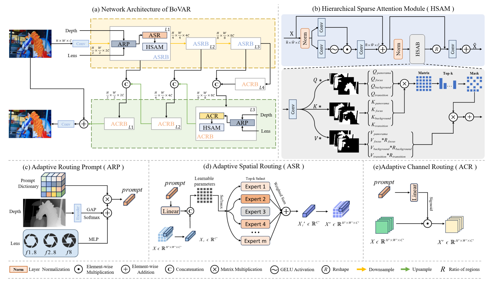

# BoVAR: Learning Adaptive Routing and Hierarchical Attention for Variable-Aperture Bokeh Rendering

Kang Chen, ShijunYan, Aiwen Jiang, Zhifeng Wang, Long Peng, Qiuhai Yan, Zhiwei Chen

[]()

> **Abstract:** Bokeh effect can significantly improve the aesthetic quality of photographs. Traditionally, achieving this effect necessitates the use of expensive high-end large-aperture lenses. However, in recent years, researchers in computational photography have endeavored to replicate bokeh on mobile devices that have limited optical capabilities. Nevertheless, current mainstream methods still encounter challenges such as unreliable subject recognition leading to improper blurring of focus region, and limited generalization capacity due to the lack of real-world multi-aperture training data.
To overcome these limitations in rendering effects, we propose a lightweight framework that introduces two key innovations. The first innovation is Adaptive Bokeh Routing, which is established using a Mixture of Experts (MoE) architecture. This component allows for the dynamic adjustment of bokeh intensity by analyzing depth-of-field and lens parameters. The second innovation, Hierarchical Sparse Attention, facilitates precise discrimination between foreground and background by employing multi-scale spatial relationship modeling.
To tackle the issue of data scarcity, we have curated a Variable-Aperture Transform Dataset (VATD) that comprises high-resolution images with adjustable lens configurations across various real-world scenarios. Experimental results conducted on our dataset, along with publicly available benchmark datasets, demonstrate that our proposed framework outperforms existing state-of-the-art methods while utilizing only 0.521M parameters and 4.59 GFLOPs of computation.



BoVAR, trained on our proposed VATD dataset, demonstrates robust generalization in real-world scenarios (images from online sources), delivering photorealistic bokeh effects across indoor/outdoor environments without compromising subject integrity. In the figure, the first row is the original image, and the second row is the realistic bokeh effect image obtained by BoVAR.


## Real Bokeh Dataset
Variable Aperture Transform Dataset ([VATD](https://pan.baidu.com/s/1U2zZmJXJwtnmIYwn4bpeTQ?pwd=4yj6))

The image was taken by a Canon EOS 70D with an image sensor width and height of 22.5×15mm, a focal length of 50mm, and four different apertures (f/1.8, f/2.8, f/8.0 and f/16.0).
 
The depth map is obtained through ([Depth-Anything-V2](https://github.com/DepthAnything/Depth-Anything-V2))

The VABD dataset needs to be placed according to the following directory structure:

```
└───Data
    └───VATD
        ├───test
        │   ├───1_8
        │   ├───2_8
        │   ├───8
        │   ├───softmasks
        │   ├───depth
        │   └───original
        └───train
            ├───1_8
            ├───2_8
            ├───8
            ├───softmasks
            ├───depth
            └───original
```


Everything is Better with Bokeh!([EBB!](https://pan.baidu.com/s/11C8UH_8EhjIsR0uNmacd9w?pwd=3wqp))

The EBB! dataset needs to be placed according to the following directory structure:

```
└───Data
    └───EBB!
        ├───val
        │   ├───depth
        │   ├───softmasks
        │   ├───original
        │   └───bokeh
        └───train
            ├───depth
            ├───softmasks
            ├───original
            └───bokeh
```
